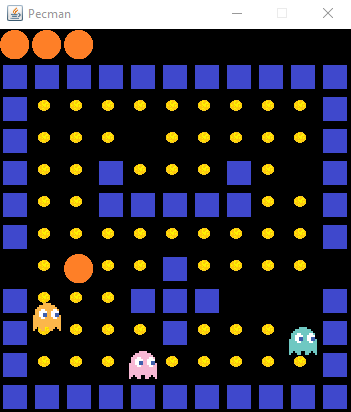

# Pac-Man 🟡👻

A simple Java game that recreates the classic Pac-Man.  
The game was developed using Java Swing.

---

## 👻 Enemies in the Game


---

## 🕹 Features

- Player controls using the keyboard:  
  `W` = up, `S` = down, `A` = left, `D` = right  
- Collect points by eating pellets/cheese  
- Ghosts with individual behavior  
- Game over upon collision with a ghost

---

## 🎮 Screenshots

### Game Start


### In-Game


---

## 🚀 Installation & Execution

1. Clone or download the project:
   ```bash
   git clone https://github.com/Amerov1/Pac-Man.git
   ```

---
