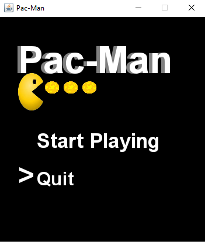

# Pac-Man 🟡👻

Ein einfaches Java-Spiel, das den klassischen Pac-Man nachbildet.  
Das Spiel wurde mit Java Swing entwickelt.

---

## 👻 Gegner im Spiel


---

## 🕹 Features

- Spielersteuerung mit der Tastatur:  
  `W` = oben, `S` = unten, `A` = links, `D` = rechts
- Punkte sammeln durch das Einsammeln von Pellets
- Geister mit individuellem Verhalten
- Spielende bei Kollision mit einem Geist

---

## 🎮 Screenshots

### Spielstart


### Während des Spiels


---

## 🚀 Installation & Ausführung

1. Projekt klonen oder herunterladen:
   ```bash
   git clone https://github.com/Amerov1/Pac-Man.git
